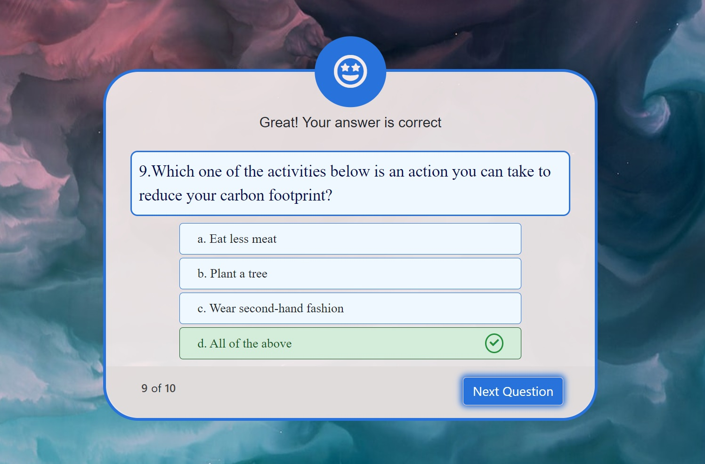

# Climate Change

At ClimateChange Website, we are dedicated to driving positive change by addressing one of the most critical challenges of our time: climate change. Our website serves as a comprehensive platform designed to inform, inspire, and empower individuals, communities, and organizations to take meaningful action in the fight against climate change.
Visit our quiz page to test your knowledge about climate change and sustainability. Challenge yourself and your friends with interactive quizzes that not only educate but also inspire action.

The live link can be found here - [Climate Change](https://benni-github.github.io/project-02-climate-change/)

Table of Contents

  * [Site Owner Goals](#site-owner-goals)
  * [User Stories](#user-stories)
    + [First Time User](#first-time-user)
    + [Returning user](#returning-user)
  * [Design](#design)
    + [Imagery](#imagery)
    + [Color Schemes](#color-schemes)
    + [Fonts](#fonts)
    + [Layout](#layout)
    + [Wireframes](#wireframes)
  * [Features](#features)
    + [Home Page](#home-page)
    + [Quiz Page](#quiz-page)
    + [How to Take the Quiz](#how-to-take-the-quiz)
    + [Scores](#scores)
  * [Testing](#testing)
    + [Validator Testing](#validator-testing)
      - [HTML](#html)
      - [CSS](#css)
      - [Javascript](#javascript)
    + [Input Testing](#input-testing)
    + [Button Testing](#button-testing)
    + [Quiz Testing](#quiz-testing)
    + [Browser Testing](#browser-testing)
    + [Device Testing](#device-testing)
    + [Fixed Bugs](#fixed-bugs)
      - [SetTimeout() method on next question](#settimeout---method-on-next-question)
      - [Result of 0% ](#result-of-0%)
    + [Known Bugs](#known-bugs)
  * [Technologies Used](#technologies-used)
    + [Languages](#languages)
    + [Frameworks - Libraries - Programs Used](#frameworks---libraries---programs-used)
  * [Deployment](#deployment)
  * [Cloning](#cloning)
  * [Credits](#credits)
    + [Content](#content)
    + [Media](#media)
    + [Resources Used](#resources-used)
  * [Acknowledgments](#acknowledgments)

<small><i><a href='http://ecotrust-canada.github.io/markdown-toc/'>Table of contents generated with markdown-toc</a></i></small>

## Site Owner Goals
- The primary goal is to educate the public about climate change, its causes, consequences, and potential solutions. This includes providing accurate and up-to-date information to dispel myths and misconceptions.
- To present the user with a website that is visually appealing and fully responsive.
- To allow the users to assess their knowledges after reading the website contents by taking the quiz.
- To entice the user to return to the quiz to improve their score.
- To allow the user to choose the theme of website (light mode or dark mode).

## User Stories

- ### First Time User
  - As a first time user I want to understand the main purpose of the website.
  - As a first time user I want to be able to intuitively navigate the quiz and donate box.
  - As a first time user I want to learn about climate change crisis and assess my understanding through this issue by taking the quiz.

- ### Returning user
  - As a returning user I want to be able to contact and have communication for further issues.
  - As a returning user I want to be able to take a quiz again to increase my score.
  - As a returning user I want to be able to support the website and team working for this hazard by donation.

## Design
The imagery and color scheme of the site were both given careful consideration to ensure they compliment each other. 

### Imagery
- The imagery used in the main page is very important. it is clearly shows the concept of the website.
- All the images in the site desiged according to two themes, and by changing the theme of website the images change. 
- Given that the quiz page relates to climate change crisis, the background image is designed dynamicly. and by refreshing the page it changes with a new related photo. 
- Some small images for 'what can we do' section used according to subject of the item.

### Color Schemes
The color schemes of the site changes according to the selected theme. 

##### Light theme color palette from Colors:

- The light theme provides a clean and vibrant appearance, with a white background and contrasting dark text. It offers a fresh and welcoming feel, suitable for general content and information presentation.

##### Dark theme color palette from Colors

- The dark theme creates an elegant and visually appealing atmosphere with a dark background and light text. It reduces eye strain in low-light environments and provides a modern, sleek look for users who prefer darker interfaces.

##### Quiz theme color palette from Colors

- The color scheme for our quiz page aims to be engaging and user-friendly. It uses bright, contrasting colors against a light pink background to make the quiz questions and options stand out, ensuring a pleasant and interactive experience for users.
- using green and red color for the right and wrong answers is a common way to notice the user about the result of question intuitively according to user experience format.

### Fonts
- The Inter font is the main font used throughout the main page. This font was imported via [Google Fonts](https://fonts.google.com/). 
- For quiz page multiple fonts are used for difference purposes. the main font of the quiz page is Work San, and for the question and its options the used font is Times New Roman to make the appearance more formal. Also for the counter the suitable font which is used is Orbitron to show a better appearance of Time. for the result page Gills is the font I used.  
- Sans Serif is used as a backup font, in case for any reason the main font isn't being imported into the site correctly.

### Layout
#### The main page of the site is a single page with 7 sections:
  - Navigation
  - First veiw of the site
  - Descriptions about the Climate change in three sections
  - Description about what can we do
  - Contact area
  - Footer of the site
  - The hidden donation box which will be appeared after pressing the donate button

#### The quiz page of the site is a single page with 3 sections:
  - Introduction box of quiz
  - The question box includes 10 questions
  - The result box

### Wireframes
Wireframes were produced using Balsamiq.
 

 
Desktop Wireframe of main Page

 

 

    
Mobile Wireframe of main Page

 

 

 
Desktop Wireframe of quiz Page

 

 

    
Mobile Wireframe of quiz Page

 

## Features

### Home Page
##### The landing page of the website has some features:
 - The Navigations which leads to the proper destination.
 - The theme button which can shift the theme from light mode to dark mode and vice versa. 
 
 
 - The main page include 2 buttons which open the quiz page and donation box.
 
 - The contents of the website are put in three sections and for good appearance they are used by Read More/Read Less buttons to make a better UX. 
 

### How to take the Quiz
  - As soon as the user enter to the quiz area the introduction page shows up and the user can read the purpose of the quiz and the instruction to take the quiz properly.
  - User can expand the contents to read each part.
  - The Introduction box has two buttons to let the user choose between start the quiz or quit it. by choose quit a window appears to confirm the user's decision and by pressing the 'start quiz' button the question box shows up immediately.
  

### Quiz Page
##### The Quiz page of the website has some features:
  - The question box has time counter and it drops down from 20 to zero. 
  - User has one fortune to choose the right answer and after the choosing the answer the right answer change to green color and if the answer was wrong the option become red. 
 
 
  - If the time for each question reach to zero the answer will be shown and after 2 second it goes to the next question.
 
  - Next question will appear after the time reach to zero or the user press the next question button or 2 seconds after choosing the answer.
  - The smile or sad Icon will be shown as soon as the user choose the answer. 
  - At the end user can figure out the score and read the quotes according to the score he got. 
  - User has option to restart the quiz or quit it.  
 

### Scores

The score of the quiz calculated according to percentage basis. and the user will get a quote while the see the scores according to below procedures:
- For 100% : Excellent ! You answered all the questions correctly.
- For equal or higher than 70% : Well done! You answered (right answers amount) of 10.
- For equal or higher than 40% : Good! You answered (right answers amount) of 10.
- For equal or higher than 10% : Not bad! You answered (right answers amount) of 10.
- If 0% : Sorry! You Couldn't answer any of the questions.

## Testing

### Validator Testing
- #### HTML
    - No errors were returned when passing through the official W3C Markup Validator
        - [W3C Validator Results](https://validator.w3.org/nu/?doc=https%3A%2F%2Fbenni-github.github.io%2Fproject-02-climate-change%2F)
- #### CSS
    - No errors were found when passing through the official W3C CSS Validator 
        - [W3C CSS Validator Results](https://jigsaw.w3.org/css-validator/validator?uri=https%3A%2F%2Fbenni-github.github.io%2Fproject-02-climate-change%2F&profile=css3svg&usermedium=all&warning=1&vextwarning=&lang=en)
- #### Javascript
    - No errors or warnings were returned when passing through the the [JSHint Validator](https://jshint.com/)

  
  

### Button Testing
- All buttons were tested manually to ensure the user is directed to the correct section of the website and functions run as intended.

### Quiz Testing
- The Quiz was thoroughly tested by friends and family to ensure that everything worked as intended including the following:
  - Correct and incorrect answers works correctly.
  - The right answer will be shown after the user choose a wrong answer. 
  - The quiz background shows different images while user refresh the page.
  - The time is working precisely.
  - The Circle line is rounding according to time drop down.
  - The Icon replaces the timer correctly according to the answer is right or wrong.
  - The timer stops when the user does not answer the question and the next question shows up.
  - The score is not considered for the missed or passed questions.
  - The correct score is shown once the quiz ends.
  - The quote sentence is shown correctly according to the score of quiz.
  - The percentage circle bar shows correctly according to the score.

### Browser Testing
- The Website was tested on Google Chrome, Firefox, Microsoft Edge, Safari browsers with no issues noted.
    
### Device Testing
- The website was viewed on a variety of devices such as Desktop, Laptop, iPhone 8, iPhoneX and iPad to ensure responsiveness on various screen sizes in both portrait and landscape mode. The website performed as intended. The responsive design was also checked using Chrome developer tools across multiple devices with structural integrity holding for the various sizes.
- I also used the following website to test responsiveness:
    - [Responsinator](http://www.responsinator.com/?url=https%3A%2F%2Fbenni-github.github.io%2Fproject-02-climate-change%2F)

### Fixed Bugs

#### SetTimeout() method on next question
- I create a setTimeout function to pass the question to the next one after 2 seconds.
- When user press the next question button whitin 2 seconds, it jumps twice.
- In this case I created another function to disable the next question button as soon as the answer selected.

#### Result of 0% 
- When the users dont answer any of the question the result shows 1%.
- I created a conditional function to fix this problem.

### Known Bugs
There are no known bugs.

## Technologies Used

### Languages
- JavaScript
- HTML5
- CSS3

### Frameworks - Libraries - Programs Used
- [Am I Responsive](http://ami.responsivedesign.is/) - Used to verify responsiveness of website on different devices.
- [Responsinator](http://www.responsinator.com/) - Used to verify responsiveness of website on different devices.
- [Balsamiq](https://balsamiq.com/) - Used to generate Wireframe images.
- [Chrome Dev Tools](https://developer.chrome.com/devtools/) - Used for overall development and tweaking, including testing responsiveness and performance.
- [Boxicons](https://boxicons.com//) - Used for icons in main page.
- [Font Awesome](https://fontawesome.com/) - Used for icons in quiz page.
- [GitHub](https://github.com/) - Used for version control and hosting.
- [Google Fonts](https://fonts.google.com/) - Used to import and alter fonts on the page.
- [TinyPNG](https://tinypng.com/) - Used to compress images to reduce file size without a reduction in quality.
- [W3C](https://www.w3.org/) - Used for HTML & CSS Validation.
- [Coolors](https://coolors.co/) - Used to create color palettes.
- [Favicon](https://favicon.io/) - Used to create the favicon.
- [ionicons](https://unpkg.com/) - used to create the dark/light icons.

## Deployment

The site was deployed using GitHub pages. The steps to deploy using GitHub pages are:

1. Go to the repository on GitHub.com
2. Select 'Settings' near the top of the page.
3. Select 'Pages' from the menu bar on the left of the page.
4. Under 'Source' select the 'Branch' dropdown menu and select the main branch.
5. Once selected, click the 'Save'.
6. Deployment should be confirmed by a message on a green background saying "Your site is published at" followed by the web address.

The live link can be found here - [Climate Change](https://benni-github.github.io/project-02-climate-change/)

## Cloning

To clone this repository follow the below steps: 

1. Locate the repository at this link [Climate Change Repository](https://github.com/BENNI-GITHUB/project-02-climate-change).
2. Under **'Code'**, see the different cloning options, HTTPS, SSH, and GitHub CLI. Click the prefered cloning option, and then copy the link provided. 
3. Open **Terminal**.
4. In Terminal, change the current working directory to the desired location of the cloned directory.
5. Type **'git clone'**, and then paste the URL copied from GitHub earlier. 
6. Type **'Enter'** to create the local clone. 

## Credits

### Content
- The Questions are provided from [Unicef Quiz](readme/Climate-Change-Quiz-with-answers.pdf)
- According to the questions I used ChatGPT to create the relevant contents for the main page. 

### Media
- The background image of the quiz page is linked to **unsplash.com** and for this subject it changed by refreshing the page.
- The main page images downloaded from [Unsplash](https://unsplash.com/photos/Ekzf8kIKizQ). 
- The sections images and the small images for 'what can we do' were downloaded from [icon8](https://icon8.com).
- I used Photoshop to change the mode and color of the photos from dark to light or vice versa.

### Resources Used

- [W3Schools](https://www.w3schools.com/)  
- [Stack Overflow](https://stackoverflow.com/)
- [Youtube](https://youtube.com)

## Acknowledgments
My mentor Mr. Antonio Rodriguez for his support and advices.